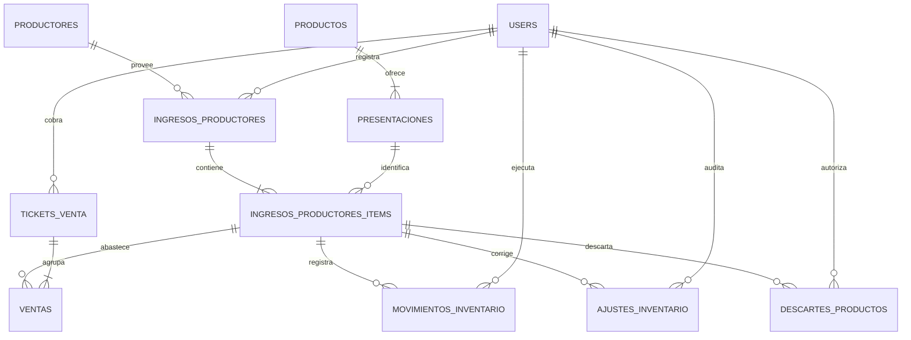

# Diagrama ER del inventario comercial

## Significado de las tablas nuevas

- `ajustes_inventario`: correcciones físicas auditadas. Guarda el saldo anterior, el nuevo, su diferencia, motivo, estado y responsables. Una anulación aplica un movimiento inverso; no borra el historial.
- `descartes_productos`: bajas controladas por caducidad, daño, deterioro u otra causa. Guarda cantidad, costo, pérdida, estado y responsables. Solo al procesarse descuenta stock.
- `movimientos_inventario`: bitácora común de entradas, salidas, regularizaciones, ajustes y descartes que afectan un lote.

`presentaciones.stock` es el saldo agregado; `ingresos_productores_items.cantidad_disponible` es el saldo por lote. Los servicios transaccionales actualizan ambos valores juntos. No existen tablas de liquidaciones ni devoluciones en el esquema vigente.
